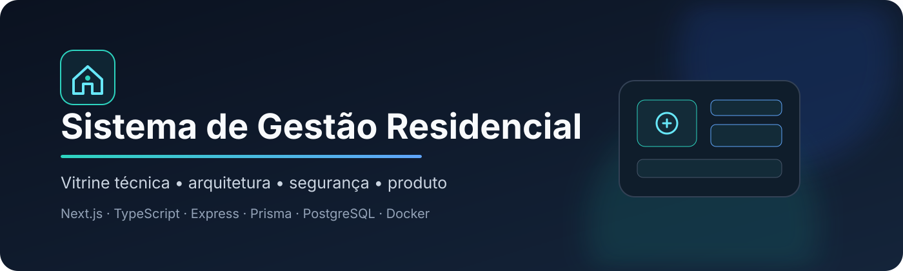
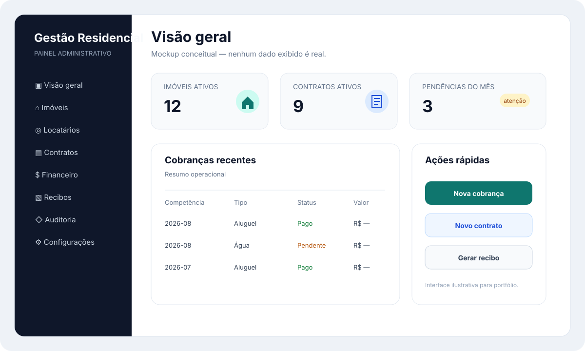

<p align="center">
  
</p>

# Sistema de Gestão Residencial — Vitrine Técnica

Protótipo full-stack **em desenvolvimento** para centralizar rotinas de imóveis, locatários, contratos, cobranças, pagamentos, recibos e privacidade.

> **Vitrine de portfólio:** o código-fonte completo permanece privado. Esta documentação mostra arquitetura, decisões e partes já trabalhadas, mas **não significa que todos os módulos estejam concluídos, integrados ou prontos para produção**.

## Estado do projeto

| Área | Estado |
|---|---|
| Backend Express + TypeScript | ✅ Evidência no código privado |
| Prisma + PostgreSQL | ✅ Schema e modelagem presentes |
| Docker para banco/backend/frontend | ✅ Estrutura presente |
| Autenticação e autorização | 🧪 Implementadas parcialmente / em revisão |
| Painel administrativo e portal do locatário | 🧪 Em desenvolvimento e validação |
| Contratos, cobranças e regras financeiras | 🧪 Implementação relevante, sem conclusão end-to-end afirmada |
| PIX / webhooks / pagamentos | 🧪 Trabalhados, mas ainda não aprovados para operação financeira real |
| Recibos, auditoria, privacidade e PWA | 🧪 Presentes em diferentes estágios |
| Testes backend e Playwright | 🧪 Existem, mas uma baseline recente completa ainda precisa ser verificada |
| Deploy de produção | 📋 Não apresentado como concluído |
| Segurança para operação real | 📋 Pendências precisam ser resolvidas e verificadas |

Detalhamento: [`docs/ESTADO-DO-PROJETO.md`](docs/ESTADO-DO-PROJETO.md).

## Visão do produto

Rotinas de locação frequentemente ficam espalhadas entre planilhas, mensagens, contratos, comprovantes e controles manuais. O projeto foi iniciado para experimentar a centralização dessas operações e a rastreabilidade do ciclo da locação.

### Áreas trabalhadas no projeto

- gestão de imóveis;
- cadastro e gestão de locatários;
- contratos e competências mensais;
- cobranças de aluguel e água;
- juros, multas e exceções;
- integração de pagamentos/PIX;
- pagamentos manuais com justificativa;
- geração de recibos em PDF;
- painel administrativo;
- portal do locatário;
- trilha de auditoria;
- solicitações relacionadas a dados pessoais;
- experiência responsiva/PWA.

> A lista representa **escopo desenvolvido ou explorado**, e não uma declaração de que cada item esteja finalizado.

## Stack

`Next.js` · `React` · `TypeScript` · `Node.js` · `Express` · `Prisma` · `PostgreSQL` · `Docker` · `JWT` · `bcrypt` · `Jest` · `Supertest` · `Playwright`

O backend também possui camadas como `Helmet`, CORS configurável, rate limiting, CSRF e validação de requisições.

## Arquitetura

<p align="center">
  
</p>

```text
Usuário
  │
  ▼
Frontend Next.js
  │
  ▼
API Express / TypeScript
  │
  ├── autenticação e autorização
  ├── domínio residencial
  ├── regras financeiras
  ├── documentos
  ├── auditoria e privacidade
  └── integrações externas
  │
  ▼
Prisma ORM
  │
  ▼
PostgreSQL
```

O diagrama representa a arquitetura pretendida e as camadas já trabalhadas; não implica que todos os fluxos estejam completos. Veja [`docs/ARQUITETURA.md`](docs/ARQUITETURA.md).

## Interface

<p align="center">
  
</p>

> O painel acima é um **mockup conceitual de portfólio**. Os números, competências e valores são fictícios e não representam uma tela de produção nem dados de usuários reais.

## Fluxo financeiro

<p align="center">
  
</p>

Uma decisão de modelagem foi separar **cobrança** de **transação de pagamento**, deixando a validação financeira sob responsabilidade do backend. Esse desenho está implementado em partes do projeto, mas o fluxo financeiro completo permanece sujeito a revisão e testes antes de qualquer uso real.

Mais detalhes em [`docs/FLUXOS.md`](docs/FLUXOS.md).

## Modelagem

O domínio privado possui entidades para representar, entre outros conceitos:

```text
Locatário ── Contrato ── Imóvel
                 │
                 └── Cobrança mensal
                         │
                         └── vínculo com Transação de pagamento

Auditoria
Solicitações de privacidade
Configurações do sistema
```

A modelagem utiliza PostgreSQL e Prisma para relações entre contratos, cobranças, transações e registros de auditoria.

## Segurança

O sistema manipula autenticação, dados pessoais e operações financeiras, portanto segurança é tratada como requisito de arquitetura.

Entre os controles presentes ou trabalhados no projeto estão:

- hash de senha;
- autenticação e autorização;
- cabeçalhos de segurança com Helmet;
- CORS restritivo por configuração;
- rate limiting;
- proteção CSRF;
- limite de payload;
- tratamento central de erros;
- segredos por configuração de ambiente;
- trilha de auditoria;
- validação adicional de eventos financeiros.

**A existência desses controles não significa que o sistema esteja seguro para produção.** A revisão técnica identificou pontos que ainda precisam ser corrigidos e verificados.

Leia [`docs/SEGURANCA.md`](docs/SEGURANCA.md).

## Privacidade

A modelagem busca aplicar minimização de dados em partes do domínio. A vitrine não contém documentos, dumps de banco, contratos, recibos, telefones, CPFs, endereços ou dados reais de locatários.

Há estruturas para solicitações relacionadas a dados, mas isso **não representa declaração de conformidade integral com a LGPD**.

Leia [`docs/PRIVACIDADE.md`](docs/PRIVACIDADE.md).

## Testes

O projeto privado inclui Jest + Supertest no backend e Playwright no frontend. Há cenários voltados a autenticação, autorização, contratos, regras financeiras, webhooks e recibos.

Entretanto, esta vitrine **não afirma que toda a suíte atual esteja passando** até que uma execução recente e reproduzível seja verificada.

Leia [`docs/TESTES.md`](docs/TESTES.md).

## Infraestrutura

O ambiente de desenvolvimento utiliza Docker para separar banco, backend e frontend. Configurações privadas entram por variáveis de ambiente e não fazem parte desta vitrine.

Nenhum IP de servidor, usuário administrativo, senha, token de pagamento ou segredo de webhook é publicado aqui.

## Decisões de engenharia

Algumas decisões que orientaram o projeto:

- frontend e backend separados;
- TypeScript nas duas camadas;
- banco relacional para um domínio com forte integridade entre entidades;
- cobrança e transação modeladas separadamente;
- integração financeira controlada pelo servidor;
- auditoria como entidade própria;
- containers para reduzir divergência de ambiente;
- código completo privado e portfólio público sanitizado.

A justificativa e os trade-offs estão em [`docs/DECISOES-TECNICAS.md`](docs/DECISOES-TECNICAS.md).

## IA aplicada ao desenvolvimento

Agentes e modelos de linguagem foram utilizados como apoio em planejamento, implementação, refatoração, testes, revisão, documentação e investigação de falhas.

Saída de IA é tratada como proposta, não como aprovação automática. Isso é especialmente importante em autenticação, pagamentos, dados pessoais e infraestrutura.

## O que esta vitrine demonstra

O objetivo não é provar um produto finalizado, e sim mostrar experiência prática com:

- arquitetura full-stack;
- modelagem relacional;
- APIs e regras de negócio;
- segurança aplicada ao desenvolvimento;
- integração com serviços externos;
- Docker e organização de ambiente;
- estratégia de testes;
- documentação técnica;
- revisão crítica de um sistema incompleto antes de produção.

## Documentação

| Documento | Conteúdo |
|---|---|
| [`ESTADO-DO-PROJETO.md`](docs/ESTADO-DO-PROJETO.md) | implementado, parcial e pendente |
| [`ARQUITETURA.md`](docs/ARQUITETURA.md) | camadas e responsabilidades |
| [`FLUXOS.md`](docs/FLUXOS.md) | fluxos administrativo, locatário e financeiro |
| [`SEGURANCA.md`](docs/SEGURANCA.md) | controles, riscos e limites |
| [`PRIVACIDADE.md`](docs/PRIVACIDADE.md) | dados pessoais e publicação segura |
| [`TESTES.md`](docs/TESTES.md) | estratégia e cenários prioritários |
| [`DECISOES-TECNICAS.md`](docs/DECISOES-TECNICAS.md) | decisões e trade-offs |
| [`PUBLICACAO.md`](docs/PUBLICACAO.md) | checklist para publicação |

## Código-fonte

O código integral do produto **não é distribuído neste repositório**. O objetivo é permitir avaliação técnica sem entregar a implementação completa nem expor dados e configurações privadas.

## Status

**Protótipo avançado em desenvolvimento e revisão técnica.** Há módulos relevantes implementados, mas o sistema não é apresentado como concluído, certificado ou pronto para operação financeira real.

## Autor

**Júlio Cézar**  
Estudante de Ciência da Computação · Técnico em Desenvolvimento de Sistemas

[LinkedIn](https://www.linkedin.com/in/j%C3%BAlio-c%C3%A9zar-0a26152b2/) · [GitHub](https://github.com/Jczarf)
