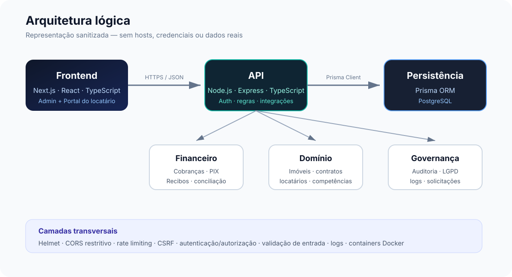

# Arquitetura

## Objetivo

Este documento apresenta a arquitetura lógica da aplicação de gestão residencial sem expor código-fonte privado, hosts, credenciais, chaves, dados de locatários ou detalhes operacionais do ambiente real.



## Visão por camadas

### Frontend

O frontend é construído com **Next.js, React e TypeScript**. A aplicação separa as experiências de administração e de locatário, consumindo a API por HTTP.

Responsabilidades principais:

- navegação e apresentação;
- formulários e validações de interface;
- painel administrativo;
- portal do locatário;
- experiência responsiva/PWA;
- consumo de endpoints autenticados.

### API

O backend utiliza **Node.js, Express e TypeScript**. A API centraliza autenticação, autorização, regras de negócio e integrações.

No projeto privado, as rotas são organizadas por domínio, incluindo autenticação, locatários, imóveis, contratos, finanças, recibos, configurações, solicitações LGPD e webhooks.

A inicialização da API aplica camadas como Helmet, CORS restritivo, rate limiting, proteção CSRF, limites de payload e tratamento central de erros antes de registrar as rotas de negócio.

### Domínio

Os principais agregados do sistema são:

- locatário;
- imóvel;
- contrato;
- competência/cobrança;
- transação de pagamento;
- recibo;
- configurações;
- auditoria;
- solicitação relacionada a direitos de dados.

### Persistência

A persistência utiliza **Prisma ORM + PostgreSQL**. O modelo foi desenhado para representar contratos, cobranças mensais, transações, relacionamentos entre cobranças e pagamentos, além de trilhas de auditoria.

### Integrações

O sistema possui uma camada para integrações externas, principalmente pagamentos. A vitrine não publica IDs, tokens, webhooks reais, URLs de produção ou credenciais.

## Containers

O ambiente privado utiliza Docker para isolar banco, backend e frontend. Serviços administrativos de banco também podem ser usados apenas localmente.

Na vitrine, a topologia é representada de forma genérica:

```text
Navegador
   │
   ▼
Frontend
   │
   ▼
Backend/API
   │
   ├── PostgreSQL
   └── Integrações externas
```

## Princípio de publicação

Esta vitrine segue a regra **"mostrar engenharia sem publicar o produto completo"**. Por isso, o repositório contém documentação, diagramas e decisões técnicas, enquanto a implementação principal permanece privada.
