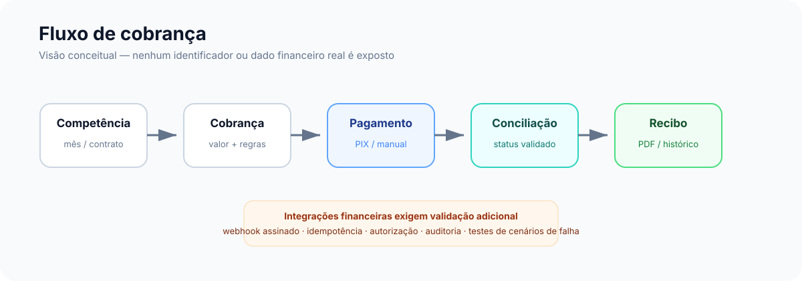

# Segurança

## Contexto

O sistema manipula autenticação, contratos, cobranças, documentos e dados pessoais. Por isso, a segurança é tratada como parte da arquitetura e não apenas como uma etapa final.

Esta documentação descreve o modelo de segurança em nível de portfólio. Detalhes operacionais, segredos, chaves, endereços de infraestrutura e regras internas sensíveis permanecem fora deste repositório.

## Controles presentes no projeto

Entre os mecanismos adotados no backend estão:

- `Helmet` para cabeçalhos HTTP;
- CORS com origens permitidas por configuração;
- `express-rate-limit`;
- proteção CSRF;
- limites de payload;
- validação de tipo de requisição;
- autenticação e autorização por papéis/contexto;
- hash de senha com bcrypt;
- segredos fornecidos por variáveis de ambiente;
- tratamento de erros sem devolver stack trace ao cliente;
- trilha de auditoria para operações relevantes.

## Dados pessoais

A modelagem procura reduzir coleta desnecessária. Um exemplo é a decisão de armazenar apenas parte do CPF quando o identificador completo não é necessário para a regra de negócio.

O sistema também prevê fluxo para solicitações relacionadas a dados pessoais, como exportação e exclusão, além de registro de aceite e informações de privacidade.

Isso não significa, por si só, conformidade jurídica completa. LGPD envolve também processos organizacionais, bases legais, retenção, contratos, governança, segurança operacional e atendimento aos titulares.

## Pagamentos

A área financeira recebe tratamento mais restritivo porque falhas podem gerar impacto econômico.

Pontos considerados na revisão:

- assinatura/autenticidade de webhooks;
- idempotência;
- autorização de operações financeiras;
- reconciliação entre transação e cobrança;
- prevenção de alteração indevida de status;
- logs de auditoria;
- cenários de falha e repetição de eventos;
- separação entre pagamentos manuais e integrados.

## Estado de segurança

A existência desses controles **não equivale a certificação de segurança nem a prontidão para produção**.

Durante a revisão do projeto foram identificados itens que precisam ser tratados como bloqueadores antes de qualquer ambiente real. Por isso, a documentação pública usa uma classificação conservadora:

> **Projeto em revisão de segurança — não apresentado como production-ready.**

## Segredos

Nenhum segredo real deve ser incluído nesta vitrine.

Não publicar:

- `.env`;
- chaves JWT;
- tokens de pagamento;
- segredos de webhook;
- senhas de banco;
- usuários administrativos reais;
- IPs/hosts internos;
- dados de locatários;
- documentos, recibos ou contratos reais.

Caso um segredo seja versionado acidentalmente, a ação correta é **revogar/rotacionar o segredo**, não apenas apagar o arquivo do commit atual.

## Disclosure

Se esta vitrine for tornada pública e alguém identificar uma vulnerabilidade na documentação ou em material demonstrativo, o contato deve ser feito de forma privada pelo perfil do autor, sem publicação de dados sensíveis em issues públicas.
